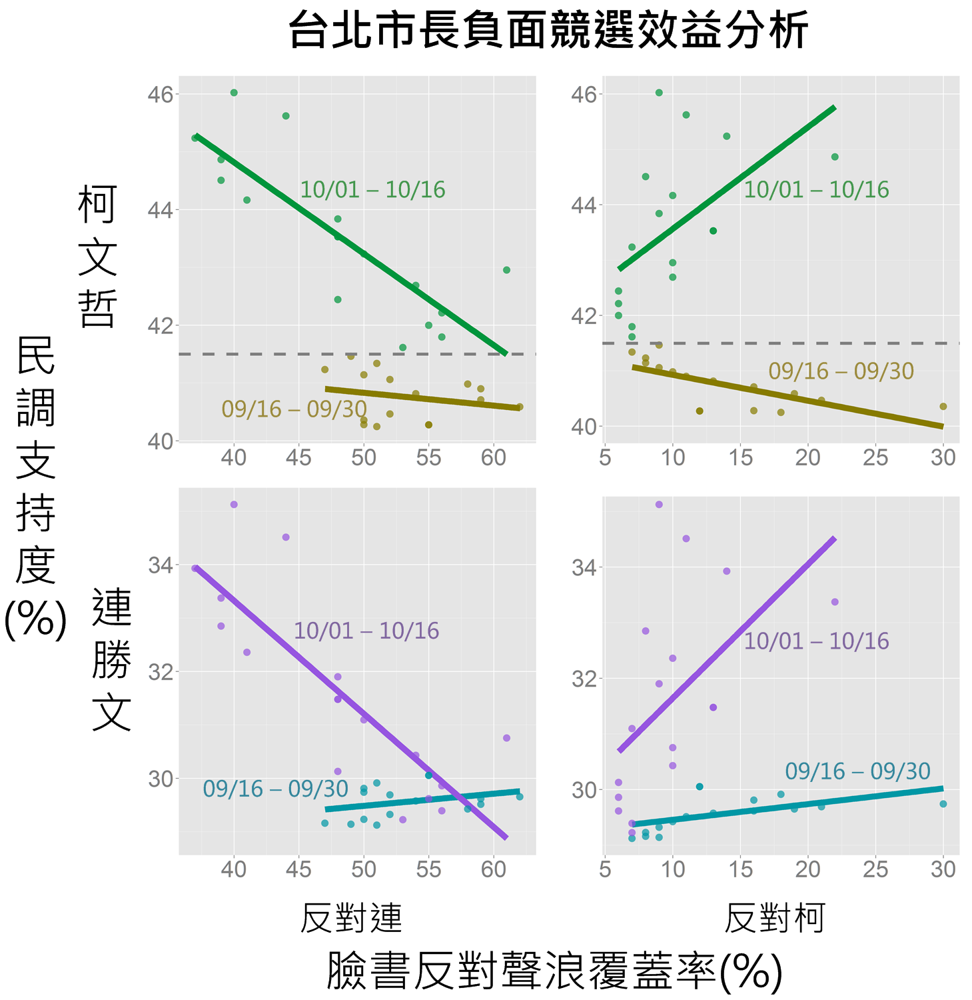

台北市長負面競選效益分析
=======
[DAY11] 台北市長負面競選效益分析 (緣由:http://hackfoldr.org/5050/)

http://readata.org/negative-campaigning/

台灣的選舉過程中負面選舉總是媒體主要追逐的焦點，透過社群媒體發布的候選人負面內容以及民調支持度進行台北市長選戰關聯性分析，發現負面消息對於柯文哲與連勝文兩位候選人的支持度有截然不同的影響。約莫選前60-70天 (9/16 - 9/30) 左右，社群媒體上無論是反對連勝文或是反對柯文哲的內容對於兩位候選人的民調支持度影響不大 (不到1個百分點)。近期 (10/1 - 10/16) 而言，負面競選對支持度就有明顯的影響。反對連勝文的內容在社群媒體散發的越多，連勝文的民調支持度越低，此外柯文哲的支持度也會隨之下降，推測批連會使得未決定支持者的游離選民不願意投票有關。當反對柯文哲的言論散發越多時，連柯兩人的支持度都會隨之上升，推測批柯會使得雙方隱性的支持者願意浮上檯面有關。

本次分析的資料來源分為民意調查資料以及臉書使用者資料兩部分。民調資料取自於維基百科，利用LOESS法預測9/16-10/16每一天候選人的民調支持度。臉書資料則是透過林克傳說收集百萬使用者的公開資料，得到支持/反對候選人內容的社群覆蓋率 (即支持/反對內容出現在一個人的塗鴉牆之平均機率)。

原始資料: data_merge.csv  
分析程式: negative0campaigning.R  
原始碼：gpl v2; 視覺呈現: CC-BY-NC 4.0  